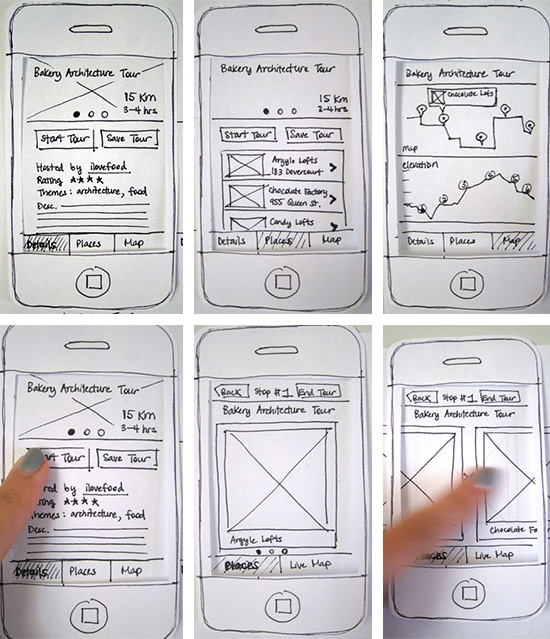

class: middle, center, inverse

# Prototyping and User Testing #

### 2016.9.7 PUI lab ###

---

# Today #

- Low-Fidelity Paper Prototyping

- User testing

- In-lab Exercise

---

class: middle, inverse

# Low-Fidelity Paper Prototyping

---

.center[]

---
class: middle, inverse

# User Testing

---
# Task scenarios for user testing

* What tasks should users be able to do with your application?

* Situate the tasks in a scenario

--
	* You and your roommate needs to clean up the room before your parents visit next week. Add that task to your shared to-do list.

---
# Do's and Don'ts

* Make the task ** realistic **

.footnote.left[https://www.nngroup.com/articles/task-scenarios-usability-testing/]

--
* Make the task ** actionable **

--

* Don't just tell the user to "do X"

--

* Don't tell the user the steps

---
class: middle, inverse

# Exercise

