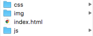

class: middle, center, inverse

# Web APIs #

### 2016.10.26 ###

---
# Logistics

* Grades for Assignment 3 released on Autolab

* Assignment 5 released, due on Nov 9
 
--
# Today

* Good practices of Web programming

* Web API
---
class: middle, inverse

# Good practices of Web programming

---
# These practices are from many experts

* Having a structure to your folder
 * Put files in separate folders for easy access

.center.img-w45[]

---
# These practices are from many experts

* Having a structure to your folder

* Separating CSS and JavaScript code from your HTML
```html
// do NOT to do this!
<head>
		<style>
			body {
			    background-color: linen;
			}
			h1 {
			    color: maroon;
			    margin-left: 40px;
			} 
		</style>
</head>
```
---
# These practices are from many experts

* Having a structure to your folder

* Separating CSS and JavaScript code from your HTML

* Put JavaScript files at the bottom

```html
		...
		<script type='text/javascript' src='jquery.js?ver=1.3.2'></script>
	</body>
</html>
```	

---
# These practices are from many experts

.grey[* Having a structure to your folder]

* Separating CSS and JavaScript code from your HTML

* Put JavaScript files at the bottom

* Indent your HTML code
---
# Bad indentation

Can you find the bug in the code?

```html
<body>
<div class="container">
<h1>Hello World</h1>
<p>This is a web page.</p>
<ul>
<li>item 1</li>
<li>item 2</li>
</div>
</body>
```
---
# Good indentation

Can you find it now?

```html
<body>
	<div class="container">
	    <h1>Hello World</h1>
	    <p>This is a web page.</p>
	    <ul>
	    	<li>item 1</li>
	    	<li>item 2</li>
    </div>
  </body>
```
---
# Good indentation

Can you find it now?

```html
<body>
	<div class="container">
	    <h1>Hello World</h1>
	    <p>This is a web page.</p>
	    <ul>
	    	<li>item 1</li>
	    	<li>item 2</li>
    	</ul>
    </div>
  </body>
```
---
# These practices are from many experts

* Having a structure to your folder

* Separating CSS and JavaScript code from your HTML

* Put JavaScript files at the bottom

* Indent your HTML code

* Max 80 characters per line
---
# Looooooooooooooooooong code
What function is the second input calling on click?

```html
<td valign="Center">
 <input type="Text" Length="45" name="txtName" language="JavaScript" onclick="return NameValid();"><br>
 <input type="Text" Length="35" name="txtAddress" language="JavaScript" onclick="return AddrValid();">
</td>
```
---
# A-ha!

```html
<td valign="Center">
	<input type="Text" Length="45" 
		name="txtName" 
		language="JavaScript" 
		onclick="return NameValid();"><br>
	<input type="Text" Length="35" 
		name="txtAddress" 
		language="JavaScript" 
		onclick="return AddrValid();">
</td>
```
---
# These practices are from many experts

* Having a structure to your folder

* Separating CSS and JavaScript code from your HTML

* Put JavaScript files at the bottom

* Indent your HTML code

* Max 80 characters per line

* Name your ids and classes responsively

---
# Bad Naming
The class name doesn't tell you about the content

```css
	#b1 {
		width: 300px;
		height: 300px;
		background-color: black;
		border: solid, black, 1pt;
	}

	#b2 {
		width: 600px;
		height: 600px;
		background-color: black;
		border: solid, black, 1pt;
	}
```
---
# Good Naming

The class name tells you about the content

```css
	#squareSm {
		width: 300px;
		height: 300px;
		background-color: black;
		border: solid, black, 1pt;
	}

	#squareLg {
		width: 600px;
		height: 600px;
		background-color: black;
		border: solid, black, 1pt;
	}
```

---
# These practices are from many experts

* Having a structure to your folder

* Separating CSS and JavaScript code from your HTML

* Put JavaScript files at the bottom

* Indent your HTML code

* Max 80 characters per line

* Name your ids and classes responsively

* Comment your code!

---
# Comments

Use comments to chunk your code

```html
<!--------------      HTML     ---------------->
<!-------------- Left menu bar ---------------->
<div>
	...
</div>
```

```css
/* -------------         CSS          -------------- */
/* ------------- Left menu bar styles -------------- */
.container {
	...
}
```

```js
// --------------  JavaScript   -------------
// -------------- Submit button -------------
$(".submit").on("click", function(){
	...
});
```

---
# References

* http://learn.shayhowe.com/html-css/writing-your-best-code/

* https://code.tutsplus.com/tutorials/30-html-best-practices-for-beginners--net-4957

* http://www.catswhocode.com/blog/top-10-best-practices-for-front-end-web-developers

* http://www.w3schools.com/css/css_howto.asp

* http://www.quepublishing.com/articles/article.aspx?p=24011&seqNum=3

---
class: middle

# We will start grading your coding styling in Assignment 5 & 6

---
class: middle, inverse

# Web APIs

---
# What and Why?
* API = Application Programming Interface

--
 * It allows you to interact with other applications, e.g., 

--
  * get someone's Fb profile: Facebook API
  * get one's twitter feed: Twitter API

---
# How? 
* Possible actions:
 * request (GET)
 * create (POST)
 * update (PUT)
 * delete (DELETE)

* A kitty example

---
# How? 

* To use an API, we start by making a request to our target application/site. 

```js
// Create a new request
xhr = new XMLHttpRequest()

// Make a request. In this case, it's a GET request
// We are getting data from the url
xhr.open("GET", url)

// Actually send the request to the server, identified by the url
xhr.send();
```

---
# How?

To see that a connection has been established.

```js
console.log(xhr.status);
```

List of status codes: https://www.wikiwand.com/en/List_of_HTTP_status_codes
---
class: middle

## Next time, we will use Facebook API to get one's profile