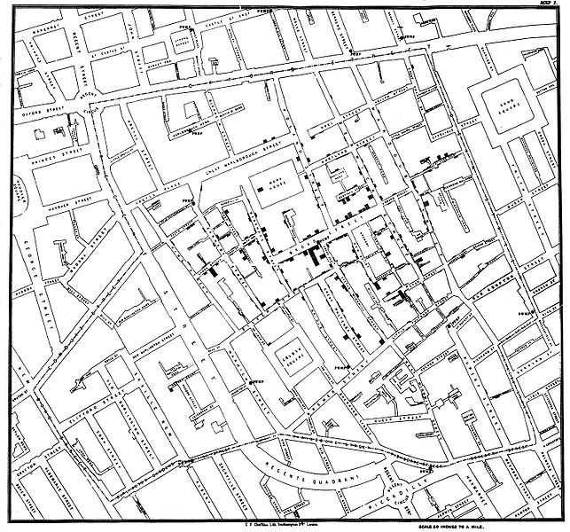
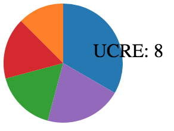

class: middle, center, inverse

# Basic Dataviz with D3#

### 2016.11.09 ###

---
# Logistics

* Assignment 5 due tonight

* Any last minute questions?

---
# Today

* All about Data visualization & D3 (a Dataviz tool)

--

* By the end of the lab, you will:

 * understand how d3 works

 * know how to use d3 to add visual elements onto html
 
---
# D3 and Dava Visualization

* A picture is worth 1000 words

.center.img-w45[]

---
# D3 setup

Just one line of code

```html
<script src="https://d3js.org/d3.v4.min.js"></script>
```

---
# How D3 works

* Remember js and jQuery can select, add, and delete DOM elements, like div?

* d3 works the same way, just using its own language

JavaScript | JQuery | d3
---------- | ------ | ----
document.querySelector("#hi"); | $( "#hi" ); | .select("#hi")
parent.appendChild(el); | $(parent).append(el); | .append(el)

* It draws svgs

---
# Let's try it out

Let's add a circle

```js
d3.select("#myChart").append("svg").attr("width", 50).attr("height", 50)
  .append("circle").attr("cx", 25).attr("cy", 25).attr("r", 25);

```

--

The code can get long and ugly very quickly! We can separate the code to multiple lines. It's easier to read as well!
--

```js
d3.select("#myChart")
  .append("svg")
  .attr("width", 50).attr("height", 50)
  .append("circle")
  .attr("cx", 25).attr("cy", 25)
  .attr("r", 25)
  .attr("fill", "red");

```

---
# Practice: Add another circle to the SVG div

With center at (80, 80), radius of 25

--
```js
 d3.select("svg")
	.append("circle")
	.attr("cx", 80).attr("cy", 80)
	.attr("r", 25)
	.attr("fill", "yellow");
```
--
Where is the second circle?

--

Make the svg larger to show the circle

---
# SVG groups
All our circles can get messy real fast

SVG groups can help us organize them (<g> a group </g>)
```js
d3.select("#myChart")
  .append("svg")
  .append("g")
  .append("circle")
  .attr("cx", 25).attr("cy", 25)
  .attr("r", 25)
  .attr("fill", "red")
  .append("circle")
	.attr("cx", 80).attr("cy", 80)
	.attr("r", 25)
	.attr("fill", "yellow");
```
--
Let's check out the DOM structure now

---
# Why should we use groups? Thoughts?


---
# You can interact with each element
Let's move the two circles simultaneously by (20, 20) when mouse over
```js
d3.selectAll("circle")
.on("mouseover", mouseover);

function mouseover(d) {
	d3.select(this)
		.transition()
		.attr("transform", "translate(20, 20)")
}
```

---
# Show color of circle on mouse over
```js
//mouseover works for all circle elements
d3.selectAll("circle")
	.on("mouseover", mouseover);

//what will show up when hover over
var tooltip = d3.select("#myChart")
 				.append("div")
 				.style("position", "absolute")
 				.style("z-index", "10")
 				.style("visibility", "hidden");

function mouseover(d) {
 	// Create a text box on hover
 	tooltip.text(d3.select(this).attr("fill"))
 			.style("visibility", "visible")
 			.style("top", event.pageY+"px")
 			.style("left", event.pageX+"px");
 	};
```

---
# Let's make a pie chart with pseudo data

My data: 

```js
var MHCIday = [
  { item: 'UCRE',  hours: 8 },
  { item: 'PUI',  hours: 3 },
  { item: 'courses for kicks and giggles', hours: 4 },
  { item: 'bond with other students', hours: 4 },
  { item: 'sleep', hours: 5}
];
```

---
# Let's make a pie chart with pseudo data

Take the data and convert it to a format for d3 pie chart

```js
var pie = d3.pie()
  .value(function(d) { return d.hours })

var slices = pie(MHCIday);
```

--
Let's do console.log to see what format the data are.

---
# Settings for a pie chart
We will learn from an example to see how to setup for a pie chart

http://square.github.io/intro-to-d3/examples/
---
# Practice: When mouse move, show details of slice

.center[]

---
# Let's scale the pie when mouse over

```js
d3.select(d).attr("transform", "scale(1.2)");
```
--
ERROR!
```
d3.min.js:3 Uncaught TypeError: this.getAttribute is not a function(…)
```

---
# Why?
What does d refer to? 

What type of object is it? 

--

A html object or a d3 object?
---

#Fix
```js
d3.select(this).attr("transform", "scale(1.2)");
```
--
Always check your object. Console.log is your best friend.
---

# Useful links

http://bl.ocks.org/mbostock

Jen Mankoff's Data Pipeline course in spring: http://data.cmubi.org/