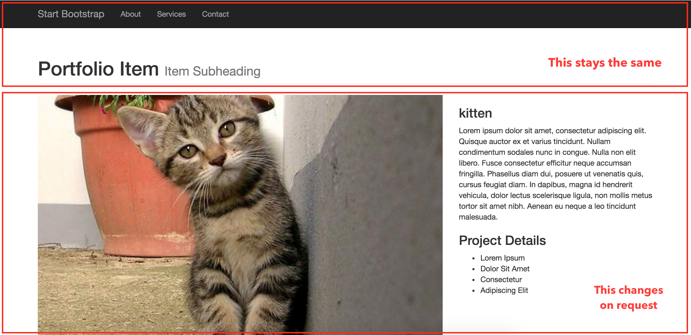

class: middle, center, inverse

# HTML Template #

### 2016.11.16 ###

---
# Logistics

* Please get started with Assignment 6 early!

* Clarification on using using existing templates

* Showcase in final lab(s)
 
---
# Today

* HTML Templates with Handlebars

* Maybe D3 collision example

---
class: middle, inverse

# Handlebars

---
# HTML templates

* They are extremely helpful if your website has the same layout for many pages
 * e.g.: http://charlottetang.com/

* You can have one HTML file for layout and reuse it for each project rather than having multiple pages for each project

---
# Installation

http://handlebarsjs.com/

```js
<script src="js/handlebars-v4.0.5.js"></script>
```
---
# Demo

Open index.html in the exercise folder

.center.img-w100[]

---
# General Flow

HTML:
```html
<!-- Some general template code -->
<script id="handlebars-showcase" type="text/x-handlebars-template">
</script>
```
--
JavaScript
```js
// Retrieve the template data from the HTML.

// Compile the template data into a function

// Create HTML code

// Insert the HTML code into the page
```
---
# HTML

```html
<script id="handlebars-demo" type="text/x-handlebars-template">
        <div class="col-md-8">
            
        </div>

        <div class="col-md-4">
            <h3>{{name}}</h3>
            <p>{{description}}</p> 
            <h3>Project Details</h3>
            <ul>
                <li>Lorem Ipsum</li>
                <li>Dolor Sit Amet</li>
                <li>Consectetur</li>
                <li>Adipiscing Elit</li>
            </ul>
        </div>
</script>
```

{{description}} means a variable with name description
---
# Content
The variables point to a content source. In this example, the content is stored in the js file:
```js
var project = {
	"name": "placehold", 
	"id": "0-placehold", 
	"thumbnail": "http://placehold.it/500x300", 
	"img": "http://placehold.it/750x500",
	"description": "This project was done in collaboration with John Doe and Jane Doe. The project focuses on lorem ipsum"
	}
```
---
# Connect data with html template

Recall the 4 steps
```js
// Retrieve the template data from the HTML.

// Compile the template data into a function

// Create HTML code

// Insert the HTML code into the page
```
---
# Connect data with html template

Recall the 4 steps
```js
// Retrieve the template data from the HTML.
var template = $('#handlebars-demo').html();

// Compile the template data into a function

// Create HTML code

// Insert the HTML code into the page
```
---
# Connect data with html template

Recall the 4 steps
```js
// Retrieve the template data from the HTML.
var template = $('#handlebars-demo').html();

// Compile the template data into a function
var templateScript = Handlebars.compile(template);

// Create HTML code

// Insert the HTML code into the page
```
---
# Connect data with html template

Recall the 4 steps

```js
// Retrieve the template data from the HTML.
var template = $('#handlebars-demo').html();

// Compile the template data into a function
var templateScript = Handlebars.compile(template);

// Create HTML code
var html = templateScript(project);
// see the html code
console.log(html);

// Insert the HTML code into the page
```
---
# Connect data with html template

Recall the 4 steps

```js
// Retrieve the template data from the HTML.
var template = $('#handlebars-demo').html();

// Compile the template data into a function
var templateScript = Handlebars.compile(template);

// Create HTML code
var html = templateScript(project);

// Insert the HTML code into the page
$("#description").html(html);
```

---

# Update the content on click

Let's say we now have 2 projects

```js
var projects = {
	"projects":[
		{
			"name": "placehold", 
			"id": "0-placehold", 
			"thumbnail": "http://placehold.it/500x300", 
			"img": "http://placehold.it/750x500",
			"description": "This project was done in collaboration with John Doe and Jane Doe. The project focuses on lorem ipsum"},
		{
			"name": "kitten",
			"id": "1-kitten", 
			"thumbnail": "http://placekitten.com/500/300",
			"img": "http://placekitten.com/750/500",
			"description" : "Lorem ipsum dolor sit amet, consectetur adipiscing elit. Quisque auctor ex et varius tincidunt. Nullam condimentum sodales nunc in congue. Nulla non elit libero. Fusce consectetur efficitur neque accumsan fringilla."}
		]};
```

---

# Update the content on click

Goal: write function such that whenever a user clicks on one of the Related Project image, the site loads the content of the project.

---

# Update the content on click

```js
$("#showcase").on("click", "a", function(evt) {
    evt.preventDefault();

    // Get content by elem id
    var id = ($(this).attr("id")).split("-")[0];
    var content = projects.projects[id]

	// Retrieve the template data from the HTML.
	var template = $('#handlebars-demo').html();

	// Compile the template data into a function
	var templateScript = Handlebars.compile(template);

	// Create HTML code
	var html = templateScript(content);

	// Insert the HTML code into the page
	$("#description").html(html);
});
```

---

# Deployment

For faster user experience, you can precompile the pages. For more information:
http://javascriptissexy.com/handlebars-js-tutorial-learn-everything-about-handlebars-js-javascript-templating/
