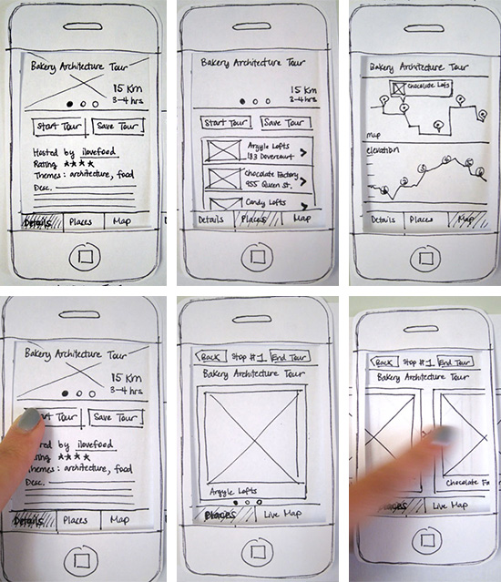

class: middle, center, inverse

# Prototyping and User Testing #

### 2016.9.7 ###

---

# Purpose of Labs #

- Low-Fidelity Paper Prototyping

- User testing

- In-lab Exercise

---

class: middle, inverse

## Low-Fidelity Paper Prototyping

---

.center[]

---
class: middle, inverse

## User Testing

---
## Task scenarios for user testing

- What tasks should users be able to do with your application?

- Situate the tasks in a scenario
	- your roommate's parents are visiting next week and you and your roommate needs to clean up the room before they get here. Add that task to your shared to-do list.
