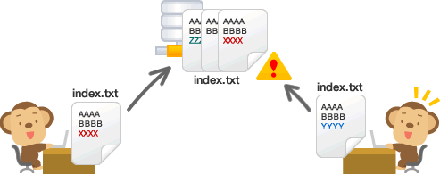

class: middle, center, inverse

# Github + Web 1 #

### 2016.9.29 ###

---

# Today #

* Setup a Github repository

* HTML + CSS refresher

* Javascript 101: a simple to-do list

---

# Announcement 
---

class: middle, inverse

# Version Control? Github? 

---
# Oldest Version Control

.center[]

---
# Github

.middle.center[]


.footnote.left[image from: https://backlogtool.com/git-guide/en/intro/intro1_1.html]

---
class: middle, center

.img-w80[]

---
class: middle

# SourceTree

---
class: middle, inverse

# HTML + CSS Refresher

---
# HTML

* Hypertext Markup Language
	* Describes the content of the page

--
* HTML breaks down to "elements"

```html
<element></element>
```
--
* Elements have attributes

```html
<element attr1 = "value1" attr2 = "value2">element content</element>
```
--
* Some "special" attributes: style, class, id

---
class: middle

```html
<!-- Specifies this is a HTML file -->
<!DOCTYPE html>		
<!-- Start of the webpage -->
	<html>
		<!-- Metadata for the page. Not displayed -->
		<head>
			<title></title>
			<!-- Where Javascript lives -->
			<script src="script.js"></script>
		</head>
		<!-- The real content of the page. Displayed -->
		<body>
		</body>
	</html>
```

---
# A to-do list: HTML

```html
<body>
	<!-- Attribute name gives the name of the form control -->
	<form name = "myChecklist">	
		<input type = "text" name = "textInput">
		<input type = "button" value = "Add Item" onclick = "addItem()">
	</form>

	<!-- Displays added item -->
	<div id="checkList"></div>
</body>
```
---
# CSS

* Adds style to your page

--

* Selector + Property

```css
p {						/* Selector */
	font-size: 12px;		/* Property */
	inline-height: 12px;	/* Property */
}
```

---
# Combining selectors

```css
div p				/* inside of */
div.class#id 		/* and */
div, p 				/* both */
```

---
# Cascading

If multiple styles, the actual final style applied is the most **“specific”** one

.img-w65.center[]

.footnote.left[Great tutorial here: http://altitudelabs.com/blog/quick-guide-to-understanding-css/]


---
# What do you mean by "specific"?

* Specificity
 * _LESS specific_ ← element < class < id → _MORE specific_

--

.middle.center[]

---
# A to-do list: CSS

```css

```