class: middle, center, inverse

# Github + Web 1 #

### 2016.9.29 ###

---
# Logistics

* Autolab

* Policy on copy-pasting code

--

 * You should write all your code
 * Totally ok to look up code using online resources (e.g., Stack Overflow). But you have to understand the code you use and type it up yourself. 

---

# Today #

* Setup a Github repository

* Chrome Debugger

* Bootstrap & Being Mobile-Friendly

* HTML/CSS refresher

* Basic JavaScript

---

class: middle, inverse

# Version Control? Github? 

---
# Oldest Version Control

.center[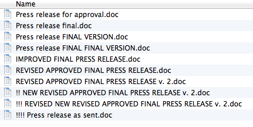]

---
# Github

* Keep track of your changes so that you can easily return to them

.middle.center.img-w80[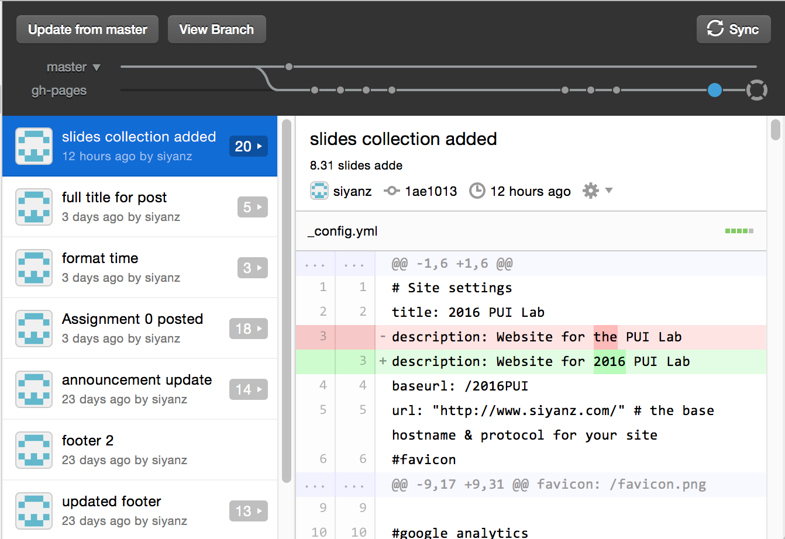]

---

# Github vocabulary

* Create a repository = Create a folder that Github will monitor for updates

* Commit = Save changes

* Revert to a commit = Undo (Ctrl-Z)

---
# Options using Github

* Command line [(tutorial)](http://blog.udacity.com/2015/06/a-beginners-git-github-tutorial.html)

* Desktop GUI [(tutorial)](https://help.github.com/desktop/guides/)

---
class: middle, inverse

# Chrome Developer Tools

---

.middle.center.img-w80[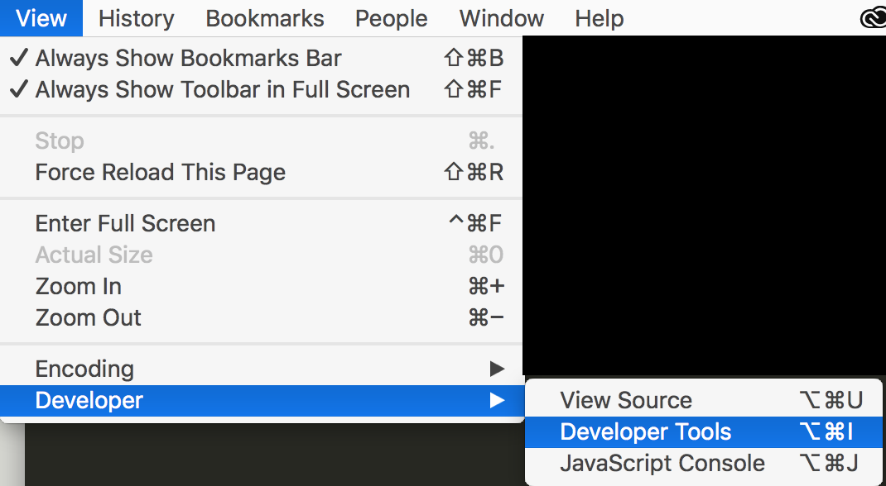]

---
# What is it for?

* View HTML elements

.center.img-w65[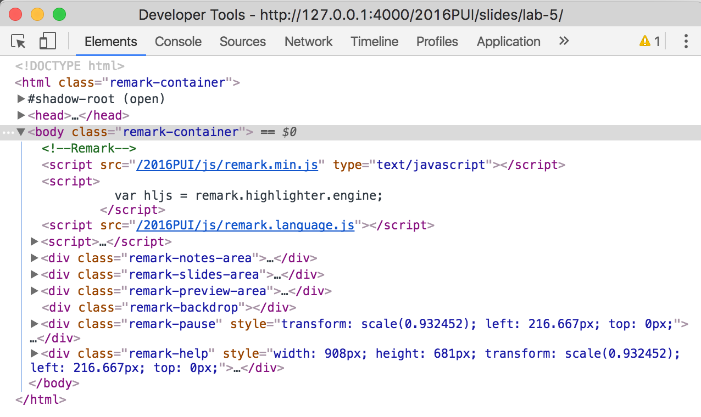]

* Change CSS Styles and see live update

* Device view 

---
# What is it for?

* View HTML elements

* Change CSS Styles and see live update

.center.img-w65[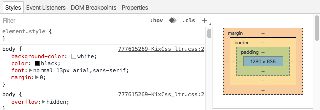]

* Device view 

---
# What is it for?

* View HTML elements

* Change CSS Styles and see live update

* Device view 

.center.img-w65[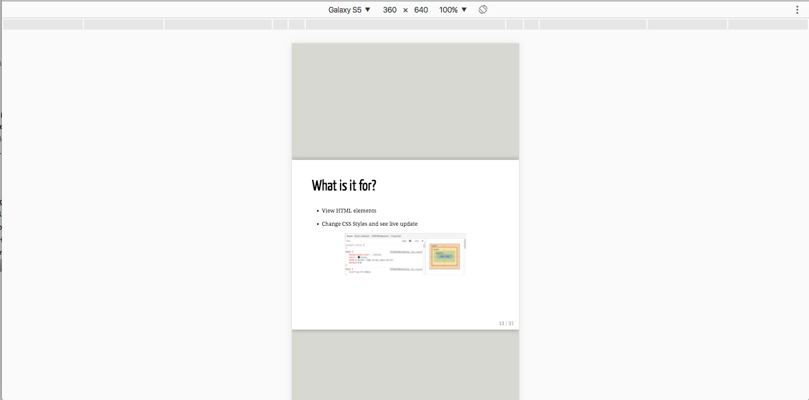]

---

class: middle, inverse

# Responsive Programming: Mobile-First

---
# Responsive design
* Fits different sizes of screen

--
* But same amount of information
 * Example: https://www.distilled.net/training/mobile-seo-guide/

--
* Mobile-first design (what we will use in this lab)
 * Design information for small screens before designing for desktop

--
* Alternative: Desktop-first design

---
# How to be responsive?

--
* Bootstrap grid layout [(more)](https://getbootstrap.com/examples/grid/)

.center.middle.img-w80[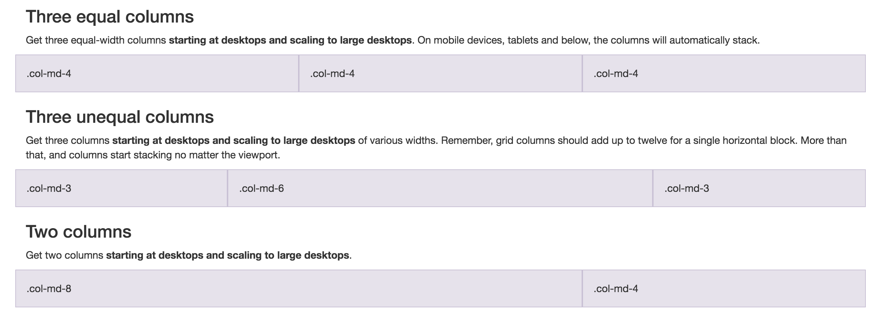]

--
* Basic idea: They display as arranged until the screen size hits breakpoints
---
# Breakpoints?

* Let's see an example first

---

```html
<!-- We start with a blank html code -->

<!-- Specifies this is a HTML file -->
<!DOCTYPE html>		
<!-- Start of the webpage -->
	<html>
		<!-- Metadata for the page. Not displayed -->
		<head>
			<title></title>
			<!-- Where Javascript lives -->
			<script src="js/script.js"></script>
		</head>
		<!-- The real content of the page. Displayed -->
		<body>
		</body>
	</html>
```

---
```html
<!-- Start of the webpage -->
	<html>
		<head>
			<title></title>
			<!-- To use Bootstrap, Link it to your HTML doc -->
			<link rel="stylesheet" href="https://maxcdn.bootstrapcdn.com/bootstrap/3.3.7/css/bootstrap.min.css" 
			integrity="sha384-BVYiiSIFeK1dGmJRAkycuHAHRg32OmUcww7on3RYdg4Va+PmSTsz/K68vbdEjh4u" 
			crossorigin="anonymous">
			<script src="js/script.js"></script>
		</head>
		<!-- The real content of the page. Displayed -->
		<body>
		</body>
	</html>
```
---
```html
<!-- we are going to add a text, a text input, and a button -->
<body>
	<div id="controls row">
		<!-- col-* means your are using Bootstrap grid system -->
		<!-- xs defines the breakpoint. xs is for smartphones -->
		<!-- 3 defines the width of your grid. It means its width is 3-unit -->
		<!-- Bootstrap breaks width of a screen to 12 columns --> 
		<p class="col-xs-3">Send to:</p>
		<input class="col-xs-7" type="text" placeholder="Search in contact">
		<button class="col-xs-2" type="button" class="btn btn-default" onclick="contacts()">
			<!-- glyphicons are icons you can embed in your text -->
			<span class="glyphicon glyphicon-user"></span>
		</button>
	</div>
</body>
```
---
# Breakpoints?

* xs - for the smallest screen widths like smartphones __< 768 px __
* sm - for small screen widths like smartphones and tablets __>= 768 px __
* md - for medium screen widths like tablets and laptops __>= 992 px __
* lg - for large screen widths like desktops __>= 1200 px__

.footnote[See more at: http://blog.codeply.com/2016/04/06/how-the-bootstrap-grid-really-works]

---
# Open your html page

* View in mobile view with Chrome Developer Tool

.center.img-w80[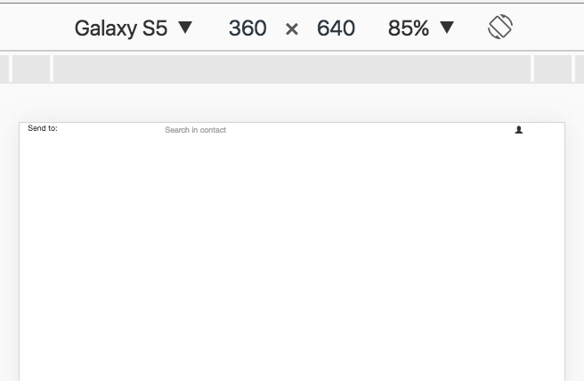]

---
# Viewport

* Man, that was tinier than expected!!!

--
* Solution: viewport

```html
<meta name="viewport" content="width=device-width, initial-scale=1">
```
* It lets the page to reflow content to match different screen sizes.

---
# Ta-da!

.center.img-w80[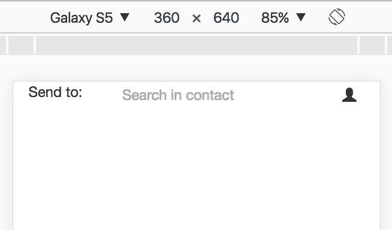]
---
# What else does Bootstrap do?

* Predefined components, such as navigation bars

```html
<!-- nav element is innate to HTML -->
<!-- navbar and navbar-default are Bootstrap stylized components -->
<nav class="navbar navbar-default">
<!-- Brand and toggle get grouped for better mobile display -->
	<div class="navbar-header">
		<a class="navbar-brand">
			<!-- set margin of h2 to 0 to align it with the rest of the navbar -->
			<h2 style="margin-top: 0;">Warm Thoughts</h2>
		</a>
	</div>
</nav>
```
---
```html
<nav class="navbar navbar-default">
	<div class="navbar-header">
		<!-- A hamburger button that is togglable (navbar-toggle) when clicked -->
		<!-- data-target specifies the content of the collapsed menu -->
		<button type="button" class="navbar-toggle collapsed" data-toggle="collapse" 
		data-target="#navbar-collapse">
				<span class="glyphicon glyphicon-menu-hamburger"></span>
		</button>
		<a class="navbar-brand">
			<h2 style="margin-top: 0;">Warm Thoughts</h2>
		</a>
	</div>
	<!-- This is the collapsed part of the menu when the window gets too small -->
	<div class="collapse navbar-collapse" id="navbar-collapse">
		<ul class="nav navbar-nav">
			<li><a href="#">Settings</a></li>
			<li><a href="#">About the site</a></li>
		</ul>
	</div>
</nav>
```
---
* To use dropdown menu, you need Bootstrap's JavaScript, which also requires jQuery

```html
<script src="https://ajax.googleapis.com/ajax/libs/jquery/1.12.4/jquery.min.js"></script>
<script src="https://maxcdn.bootstrapcdn.com/bootstrap/3.3.7/js/bootstrap.min.js" 
integrity="sha384-Tc5IQib027qvyjSMfHjOMaLkfuWVxZxUPnCJA7l2mCWNIpG9mGCD8wGNIcPD7Txa" 
crossorigin="anonymous"></script>
```
---
class: middle, inverse

# JavaScript

---
# What is JavaScript?

* It has nothing to do with JAVA

* Make dynamic pages

---
# Hello World in Chrome Developer Tool

* In our existing HTML doc, link javascript file
```html
<script type="text/javascript" src="js/script.js"></script>
```

* In the javascript file
```javascript
console.log("Hello World");
```

* In Chrome Console
.center.img-w80[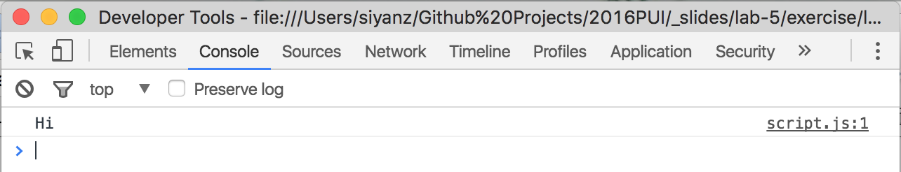]

---
* Auto-fill a text input by clicking a button

```html
<!-- The function onclick is assigned to is called whenever the button is clicked-->
<button class="col-xs-2" type="button" class="btn btn-default" onclick="contacts()">
```

--

```javascript
function contacts()
{
	// get hold of the text input element by Id (getElementById)
	document.getElementById("contactName").value = "Bob Miller";
}
```
---
* Make a button appear when text input is changed

```html
<!-- create a button and make it invisible first -->
<button id="sendButton" class="col-xs-8 offset-xs-2" type="button" class="btn btn-default" 
style="visibility: hidden;">
	Send your friend a nice thought!
</button>
```
---
```javascript
// onload is needed to get hold of the elements 
// getElementById returns null if line 2 & 3 are called before onload 
window.onload = function(){
	// Save the elements to variables so that they can be used later 
	var inp = document.getElementById("contactName");
	var but = document.getElementById("sendButton");

	// onchange is called whenever there is a change to the input 
	inp.onchange = function(){
		// First check if the value for input box is empty
		// If yes, change the visibility of the button to visible
		if (inp.value != ""){
			but.style.visibility = "visible";
		} else {
			but.style.visibility = "hidden";
		}
	}; 
};
```

---
* Also need to make button visible when the contact button is clicked

```javascript
function contacts()
{
	document.getElementById("contactName").value = "Bob Miller";
	// Called to make button visible when the button is clicked
	document.getElementById("contactName").onchange();
}

```
---
class: middle, inverse

# HTML + CSS Refresher

---
# HTML

* Hypertext Markup Language
	* Describes the content of the page

--
* HTML breaks down to "elements"

```html
<element></element>
```
--
* Elements have attributes

```html
<element attr1 = "value1" attr2 = "value2">element content</element>
```
--
* Some "special" attributes: style, class, id

---

# CSS

* Adds style to your page

--

* Selector + Property

```css
p {						/* Selector */
	font-size: 12px;		/* Property */
	inline-height: 12px;	/* Property */
}
```

---
# Combining selectors

```css
div p				/* inside of */
div.class#id 		/* and */
div, p 				/* both */
```

---
# Cascading

If multiple styles, the actual final style applied is the most **“specific”** one

.img-w65.center[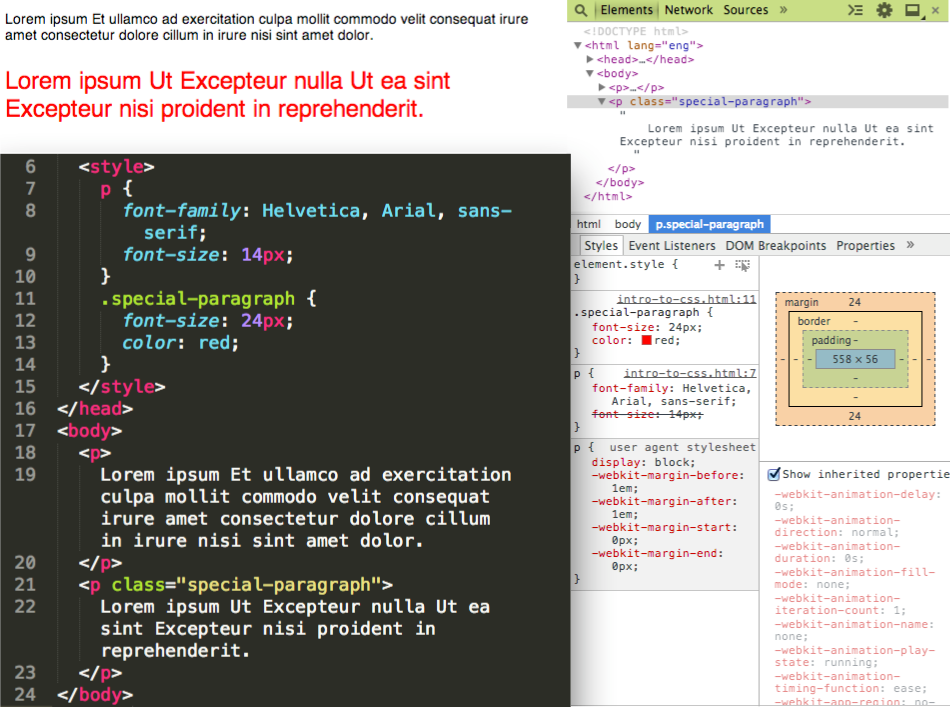]

.footnote.left[Great tutorial here: http://altitudelabs.com/blog/quick-guide-to-understanding-css/]

---
# What do you mean by "specific"?

* Specificity
 * _LESS specific_ ← element < class < id → _MORE specific_

--

.middle.center[]

---