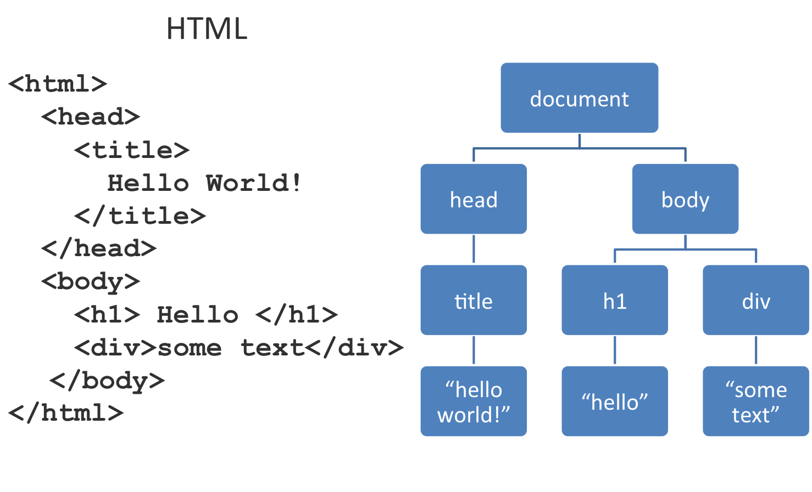

class: middle, center, inverse

# Web 2: jQuery#

### 2016.10.5 PUI lab ###

---
# Announcements

- Assignment 3 status

- Office Hours today: 3:30 - 5:30 in NSH __4201__

- Think about how you want to showcase Assignment 1 - 4 for your portfolio

---

# Today #

- DOM Review

- JavaScript vs JQuery

- Exercise

---

class: middle, inverse

# DOM Review

---
# DOM structure

.left.center.img-w80[]

--
```HTML
<li id="item" class="list"></li>
```
---
# DOM is...

* NOT static: can be changed
--

* Dynamic pages

---
# How to change DOM

* JavaScript

* JQuery: A JavaScript library

--
 * Popular

 * Simplify code

 * Works across browser (might be a concern later)

 * Faster load time

 * Animation
---
# JQuery vs Javascript

JavaScript | JQuery 
---------- | ------
document.querySelector("#hello"); | $( "#hello" );
parent.appendChild(elem); | $(parent).append(elem);
parent.parentNode.removeChild(elem); | $(elem).remove();
array.forEach(function(item){}); | .each(function(i, val){});

---
* For javaScript files
```html
<script src = "https://ajax.googleapis.com/ajax/libs/jquery/2.1.3/jquery.min.js">
</script>
```

* For CSS files
```html
<link rel= "stylesheet" href = "mystyle.css">
```

---
# Exercise
* DOM basics

* Traversing the DOM tree

* Code and Exercise handout on Piazza