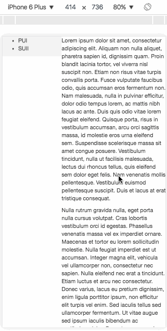

class: middle, center, inverse

# Web 3: Stylizing Your Prototype#

### 2016.10.12 PUI lab ###
Full slides: http://www.siyanz.com/2016PUI/slides/lab-7

---
# Announcements

- Questions on Assignment 4?

- Office Hours: 3 - 5 pm NSH 4501

---

# Today #

- Feedback on Assignment 2

- CSS Position Shenanigans

- Centering Elements

---
# Assignment 2 Feedback

* Everyone did a great job on the InVision Prototypes!

* Make sure the user can go back to the main screen from any screens.

---
class: middle, center, inverse

# CSS Position Shenanigans

---

# Position

```css
position: static/relative/absolute;
```

---
# Example boxes

```html
<div class="containerBox">
	<div class="outer red">
		<div class="inner green">
		</div>
	</div>
	</div>
</div>
```

---
# Default: static

.center.middle.img-w100[]
---
#  Fixed Position

```html
<div class="inner green fixed"></div>
```

```css
/* fix the position of the box relative to the window */
.fixed {
	position: fixed;
	/* botton, top, left, right defines the object's position */
	top: 10px;
	left: 10px;
}
```
---
# Fixed Position

.center.middle.img-w100[]
---
### When the red square moves, the green stays at the same place.

.center.middle.img-w100[]
---
# Relative Position

```html
<div class="inner green relative"></div>
```

```css
/* fix the position of the box relative to the window */
.relative {
	position: relative;
	/* botton, top, left, right defines the object's position */
	top: 10px;
	left: 10px;
}
```
---
# Relative Position

.center.middle.img-w100[]

---
### When the red square moves, the green square stays inside the red square at the same spot

.center.middle.img-w100[]

---
class: middle, center, inverse
# Yay! we are done with CSS positions!
---
# I wish...
---
# Absolute position
* This is where complications come in

---
### Remember fixed position? 
* Orange object has fixed position

```html
<div class="containerBox">
	<div class="outer red">
		<div class="inner green">
			<div class="mini orange fixed">
			</div>
		</div>
	</div>
</div>
```
```css
.fixed {
	position: fixed;
	bottom: 0;
	right: 0;
}
```
---
.center.middle.img-w100[]
---
### What happens if it has an absolute position?
```css
.absolute {
	position: absolute;
	bottom: 0;
	right: 0;
}
```
---
.center.middle.img-w100[]

---
### But when I change the red square to relative position
```html
<div class="containerBox">
	<div class="outer red relative">
		<div class="inner green">
			<div class="mini orange absolute">
			</div>
		</div>
	</div>
</div>
```
---
.center.middle.img-w100[]

---
# Absolute Position
* Behaves like:
 * _fixed_ when none of its parent or parent's parent or patent's parent's parent... has static position
 * _relative_ when one of its ancestry is relative

---
class: middle, center, inverse
# Why do we care about these positions?

---
# Combine them to make different layouts
```html
<div class="containerBox">
	<div class="leftMenu">
		<ul>
			<li> PUI </li>
			<li> SUII </li>
		</ul>
	</div>
	<div class="mainContent">
		<p> Lorem ipsum </p>
	</div>
</div>
```
---
```css
.leftMenu {
	position: fixed;
	left: 0;
	top: 0;
	width: 150px;
	background-color: #eee;
}

.mainContent {
	position: relative;
	margin-left: 150px;
}
```
---
.center.middle.img-w35[]

---
class: middle, center, inverse
# Centering using positions
---
# Centering is super super tricky in css
* To give you a sense: http://www.tipue.com/blog/center-a-div/
---
# Margin: 0 auto
* Back to our red and green boxes: center green in red
```css
.center {
	margin: 0 auto;
}
```
---
.center.middle.img-w100[]

---
# Cool! So I can use that to center a button!
```html
<div class="containerBox">
	<div class="outer red">
		<button class="btn btn-default center">BUTTONNNN
		</button>
	</div>
</div>
```
```css
.center {
	margin: 0 auto;
}
```
---
#Nope!
.center.middle.img-w80[]

---
# Cause button has a style: inline-block
.img-w35[]
---
.center.middle.img-w100[]
---
```css
.outer {
	width: 300px;
	height: 300px;
	text-align: center;
}
```
.center.middle.img-w80[]

---
class: middle, center, inverse
# JQuery Animation
---
# JQuery effects
* Details here: https://api.jquery.com/category/effects/
* For some examples, see code in folder: animation
---

# Rest of the class: work session
* Base on Assignment 3, think about how you want to improve the style of your prototype
* How you want the layout to be?
* What kind of animation do you want?

